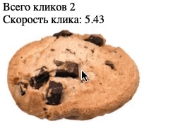

# Task-1.2-Cookie-Clicker
Игра-кликер
Домашнее задание к занятию 1.1 «Возможности JavaScript в браузере».

Описание
Необходимо разработать нового «убийцу времени» - кликер печенек. Всё, что делает игра - увеличивает счётчик нажатий на печеньку.

Исходные данные
Основная HTML-разметка

Процесс реализации
Увеличивайте значение счётчика при каждом клике на печеньку
Чередуйте уменьшение и увеличение печеньки при каждом клике (уменьшайте и увеличивайте значения width/height)
Повышенный уровень сложности (не обязательно)
Добавьте параметр «Скорость клика». Он должен показывать среднее количество кликов в секунду. Значение обновляется при каждом новом клике.

Например, с момента последнего клика прошло 0.5 секунды. Тогда скорость клика = 1/0.5 = 2 клика в секунду

Используйте тип Date для решения этой задачи

Подсказки (спойлеры)
Используемые темы
Решение задач
Перейти в папку задания. cd ./js-features/cookie-clicker.
Открыть файл task.js в вашем редакторе кода и выполнить задание.
Открыть файл task.html в вашем браузере и убедиться в правильности выводимых результатов.
Добавить файл task.js в индекс git с помощью команды git add %file-path%, где %file-path% - путь до целевого файла. git add task.js.
Сделать коммит используя команду git commit -m '%comment%', где %comment% - это произвольный комментарий к вашему коммиту. git commit -m 'first commit cookie-clicker'.
Опубликовать код в репозиторий homeworks с помощью команды git push -u origin master.
Прислать ссылку на репозиторий через личный кабинет на сайте Нетологии.
